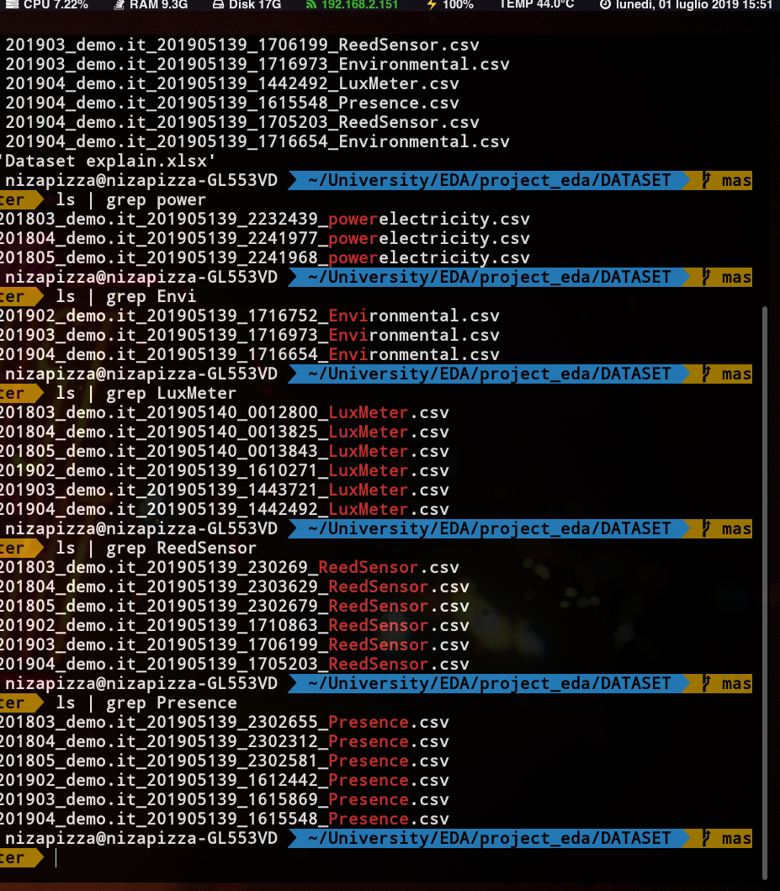
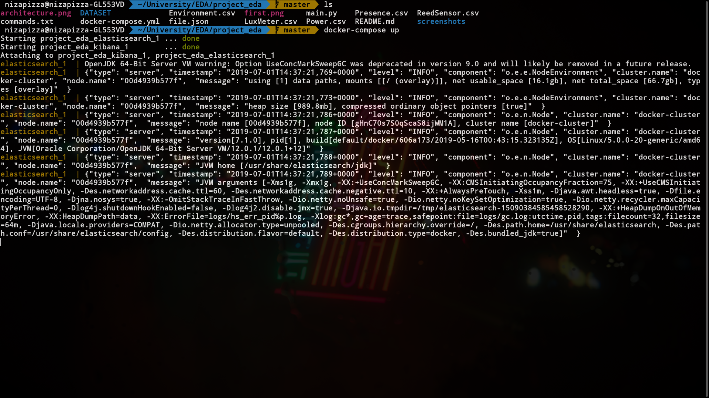
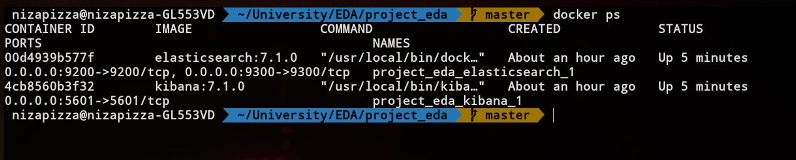

## ENTERPRISE DATA ANALYTICS PROJECT

### Data Analytics with Elasticsearch

Framework investigation for Data Analytics and Visualization with Elasticsearch 7 and Kibana.

### Objectives
- Loading the dataset
- Some timeseries visualization
- Machine learning analysis for anomaly detection and prediction on significative measurements.

#### Overview of Elastic search and Kibana

Elasticsearch is a search and analytics engine. Logstash is a server‑side data processing pipeline that ingests data from multiple sources simultaneously, transforms it, and then sends it to a "stash" like Elasticsearch. Kibana lets users visualize data with charts and graphs in Elasticsearch.

### The Dataset

The data we have to analyze is essentially split in 3 parts

- Electrical power usage
- Presence
- ReedSensor
- LuxMenter that are basically light sensors
- Environmental

If we want to do anomaly detection let's first analyze what data we have.

We can see that we have 
- 3 files for Powerelectricity data.
- 3 files for Environmental.
- 6 files for Lux
- 6 files for ReedSensor
- 6 files for Presence

When giving the data to elasticsearch, we can either loop through each one of them and push it to the elasticsearch storage through their REST API, or we can simply concatenate and merge the csv files by type of readings. So that we would end up with 1 file for each reading.

Presence files merged together are by far the heaviest. (around 100Mb).

I am using Docker in order to start the Kibana and Elasticsearch, that is for different reasons. Containers allow a cleaner deployment and management. I wrote a docker-compose file that spins up an Elastic container and a kibana one, both are versions 7.1.0

` docker-compose up `

In order to launch docker-compose up without the logs we can just execute the following command:

` docker-compose up -d` 

This will launch both images in the background

Elasticsearch need to have port 9300 and 9200 open.
Kibana needs to have the port 5601 open, it also fetches metadata from https://elasticsearch, which is pointing to the elasticsearch container in our case.
This is defined in our docker-compose file. The name of the service needs to be precisely "elasticsearch", otherwise it would not work.

Now that we have our containers set up, let's move on and see what the interface looks like.

There are essentially two ways we can import data inside the Elastic storage, the first one would be through the API. This would be the most realistic scenario in a production environment, and it would make more sense since our Apps would be pushing constantly data to ELK pipeline. In our case, having already csv files, we can just simply import them via the Kibana UI and see how it looks.

We can see that Kibana picked up the right pattern from our csv files. 

Elasticsearch has this concept of an Index.
We don't need to predefine a schema when we add values to the elasticsearch storage.

We create this kind of namespace called an index

Then we can check how it mapped our csv objects

## Time series visualization

Visualization of the count of readings per day

An example of the kibana console

Date histogram for the average electric power consumption

An more complex time serie, showing the electric power usage and the rms_current value

## Machine learning

The Elastic Stack is brilliant at quickly answering questions such as, "what are the hourly requests per second over the last week?" and visualizing results in real time. But what if you want to dig deeper and ask "is there something unusual going on?" and "what's causing this?"

The machine learning features make that possible and apply to a broad range of use cases and datasets, allowing you to get creative with where and how you use them.

Lets try to apply this to our electricity metric

### Single Metric

Kibana is able to estimate the bucket span, and we specify here to use the entire data set we have for the training.

We finally click on the Validate button to see if everything is ok and we can proceed.

We can also see that the all the parameters for the scheduled jobs have a very convenient JSON format that we can code against with any web service potentially.

Forecasting anomalies after one day

